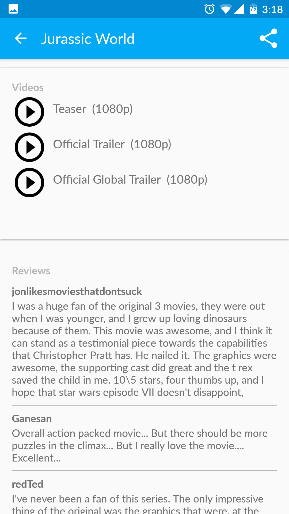

#PMDB

Here is the Project 1 of Udacity Android Nanodegree program - The Popular Movie Database.

PMDB is a fully functional Android app that helps users to discover popular and highly rated movies on the web using `themoviedb.org` API.
It displays a scrolling grid of movie posters, launches a details screen whenever a particular movie is selected, allows users to save favorites, play trailers, share movie trailers and read user reviews.

The app was evaluated by Udacity reviewers and was graded as _"Exceeds Specifications"_.

##Features

The PMDB app provides the following features:

* Discover most popular and highly rated movies
* View movie details including descriprion and air date
* View movie trailers on YouTube
* Save movies as favorite for offline access
* Read user reviews on movies
* Share movie trailer

##Screenshots

##Notes

Important notice about The Movie Database API.
In order for the API to work, the API key should be added in `Constants.java` file in `TMDB_API_KEY` property.

There is one known issue in detail view. When trying to scroll the view while dragging on overview text view the scroll doesn't work.
It is somehow caused by the fact that there is a click listener on the text view.

